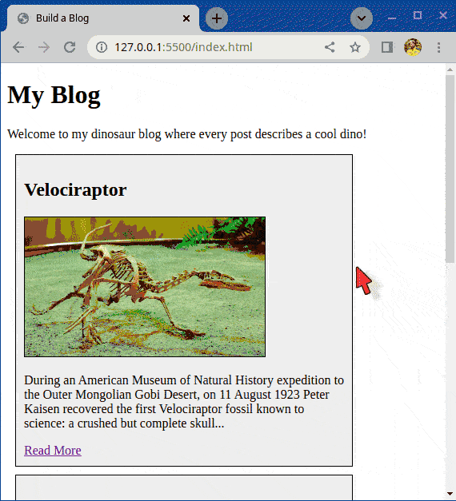

# Build a blog

Structure and build a small multi-page blog.

## What you will be doing

You can choose the topic of the blog, but you can also to use the content we've provided which includes posts about different Dinosaurs.

The content is not that important for the exercise, have fun with it!

### Example

Here's an example of how a page might look like. You don't have to copy it exactly, it's more for inspiration. The images used in the demo are included in the `images` directory.

## Tasks

### Task 1

1. Create a `posts` directory
2. Inside the `posts` directory create at least three HTML pages for your posts - `post-1.html`, `post-2.html`, `post-3.html`, etc.
3. Inside each individual post page, include;
   - The main image
   - The title
   - The full article content (example from Wikipedia)
   - A 'return to homepage' link
   - Try to use as many things you learned as possible such as;
     - Extra images, maybe a floating image in the text
     - Add a background color
     - Add colored links
     - etc.

### Task 2

1. Add the basic HTML5 boilerplate to `index.html`
2. Add a list of the posts to `index.html` including
   - The main picture
   - The title
   - The first few lines of content
   - A "read more" link that points to the full blog post such as `post-1.html`

## Hints

- Remember that you can nest many elements and use any color for the borders

[//]: # (autograding info start)
#  Results
> ⌛ Give it a minute. As long as you see the orange dot  on top, CodeBuddy is still processing. Refresh this page to see it's current status.
>
> This is what CodeBuddy found when running your code. It is to show you what you have achieved and to give you hints on how to complete the exercise.

### Homepage

|                 Status                  | Check                                                                                    |
| :-------------------------------------: | :--------------------------------------------------------------------------------------- |
|  | Blog homepage should exist |

### Images

|                 Status                  | Check                                                                                    |
| :-------------------------------------: | :--------------------------------------------------------------------------------------- |
|  | Each blog post on the homepage should contain an image from the images folder |

### Post links

|                 Status                  | Check                                                                                    |
| :-------------------------------------: | :--------------------------------------------------------------------------------------- |
|  | Homepage should contain links to blog posts |
|  | Blog post links are pointing to respective post pages |

### Back to Homepage

|                 Status                  | Check                                                                                    |
| :-------------------------------------: | :--------------------------------------------------------------------------------------- |
|  | Blog posts should contain a link back to the homepage |

[🔬 Results Details](../../actions)
[🐞 Tips on Debugging](https://github.com/DCI-EdTech/autograding-setup/wiki/How-to-work-with-CodeBuddy)
[📢 Report Problem](https://docs.google.com/forms/d/e/1FAIpQLSfS8wPh6bCMTLF2wmjiE5_UhPiOEnubEwwPLN_M8zTCjx5qbg/viewform?usp=pp_url&entry.652569746=uib-fundamentals-build-a-blog)

[//]: # (autograding info end)