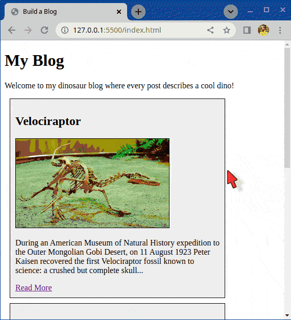

# Erstelle einen Blog

Strukturieren und erstelle einen kleinen mehrseitigen Blog.

## Was Du machen sollst

Du kannst das Thema des Blogs frei wählen, oder aber den von uns bereitgestellten Inhalt verwenden, der Beiträge über verschiedene Dinosaurier enthält.

Der Inhalt ist für die Übung nicht so wichtig, hab einfach Spaß damit!

### Beispiel

Hier ist ein Beispiel dafür, wie eine Seite aussehen könnte. Du musst es nicht exakt nachbauen, es dient mehr zur Inspiration. Die im Demo verwendeten Bilder sind im Verzeichnis `images` enthalten.

## Aufgaben

### Aufgabe 1

1. Erstelle Verzeichnis `posts`
2. Erstelle im Verzeichnis `posts` mindestens drei HTML-Seiten für deine Beiträge - `post-1.html`, `post-2.html`, `post-3.html`, usw.
3. Füge auf jeder einzelnen Beitragsseite Folgendes ein:
    - Ein Hauptbild
    - Den Titel
    - Den vollständigen Artikelinhalt (Beispiel von Wikipedia)
    - Ein Link "Zurück zur Startseite"
    - Versuche so viele Dinge wie möglich zu verwenden, die Du gelernt hast, wie zum Beispiel;
        - Zusätzliche Bilder, vielleicht ein schwebendes Bild im Text
        - Hinzufügen einer Hintergrundfarbe
        - Hinzufügen von farbigen Links
        - usw.

### Aufgabe 2

1. Füge die grundlegende HTML5-Grundstruktur (boilerplate) zu `index.html` hinzu
2. Füge eine Liste der Beiträge zu `index.html` hinzu, einschließlich
    - Das Hauptbild
    - Der Titel
    - Die ersten paar Zeilen des Inhalts
    - Ein "Weiterlesen"-Link, der auf den vollständigen Blogbeitrag wie z. B. `post-1.html` verweist

## Hinweise

- Denke daran, dass du viele Elemente verschachteln und jede Farbe für die Ränder verwenden kannst.
